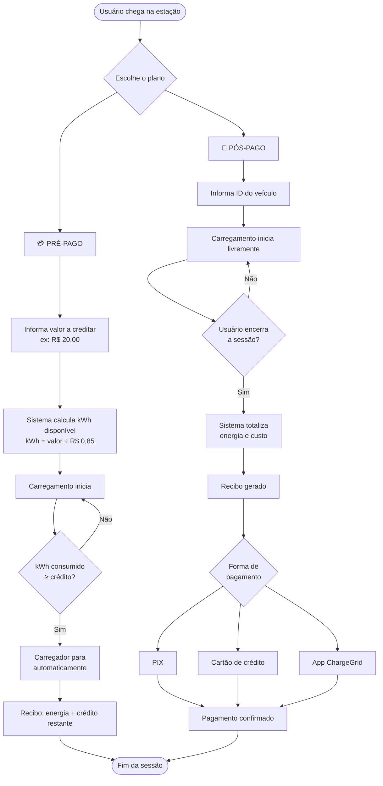
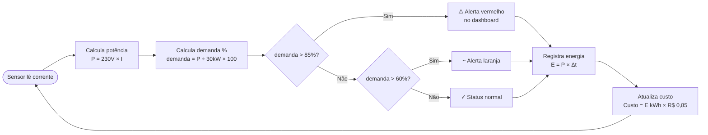

# Sprint-2-Pensamento-Computacional

# ⚡ ChargeGrid Intelligence

**FIAP · GoodWe Challenge · Sprint 2**

Sistema inteligente de gerenciamento e cobrança para estações de carregamento de veículos elétricos (EVSEs). Desenvolvido como prova de conceito funcional integrando monitoramento em tempo real, gestão de demanda e modelo de cobrança pré-pago e pós-pago.

---

## 📋 Sumário

- [Visão geral](#visão-geral)
- [Arquitetura do sistema](#arquitetura-do-sistema)
- [Fluxo de cobrança](#fluxo-de-cobrança)
- [Componentes de hardware (protótipo físico)](#componentes-de-hardware-protótipo-físico)
- [Componentes de software](#componentes-de-software)
- [Como executar](#como-executar)
- [Parâmetros técnicos](#parâmetros-técnicos)
- [Equipe](#equipe)

---

## Visão geral

O ChargeGrid Intelligence resolve três problemas centrais dos atuais pontos de recarga:

| Problema | Solução proposta |
|---|---|
| Sem controle de consumo em tempo real | Dashboard com leitura segundo a segundo via Sensor de Efeito Hall + ESP32 |
| Cobrança imprecisa ou inexistente | Sistema de tarifação por kWh com planos pré e pós-pago |
| Demanda descontrolada na rede | Alerta automático ao atingir 85 % da demanda contratada |

---

## Arquitetura do sistema

```
┌─────────────────────────────────────────────────────────────┐
│                      CAMADA FÍSICA                          │
│                                                             │
│   [Veículo Elétrico]                                        │
│         │                                                   │
│         ▼                                                   │
│   [Plug de Carga]──►[Sensor de Efeito Hall]                 │
│                              │  mede corrente (A)           │
│                              ▼                              │
│                         [ESP32]                             │
│                    tensão fixada: 230 V                     │
│                    calcula P = V × I                        │
│                    calcula E = P × Δt                       │
└──────────────────────────┬──────────────────────────────────┘
                           │ Wi-Fi / MQTT
                           ▼
┌─────────────────────────────────────────────────────────────┐
│                     CAMADA DE SOFTWARE                      │
│                                                             │
│   ┌──────────────────┐      ┌──────────────────────────┐   │
│   │  Dashboard Web   │      │  Sistema de Cobrança CLI │   │
│   │  (HTML/CSS/JS)   │      │  (Python)                │   │
│   │                  │      │                          │   │
│   │  • Potência kW   │      │  • Plano Pré-pago        │   │
│   │  • Energia kWh   │      │  • Plano Pós-pago        │   │
│   │  • Custo R$      │      │  • Recibo detalhado      │   │
│   │  • Alerta demanda│      │  • Seleção de pagamento  │   │
│   └──────────────────┘      └──────────────────────────┘   │
└─────────────────────────────────────────────────────────────┘
```

---

## Fluxo de cobrança

### Visão geral dos dois planos



---

### Lógica de gerenciamento de demanda



---

## Componentes de hardware (protótipo físico)

| Componente | Função |
|---|---|
| **Sensor de Efeito Hall** | Mede a corrente elétrica que passa pelo cabo de carga sem contato direto |
| **ESP32** | Microcontrolador com Wi-Fi integrado; processa os dados e os envia ao servidor |
| **Caixa MDF** | Estrutura física do protótipo representando a estação de recarga |
| **Extensão elétrica** | Simula o cabo de carga do ponto de recarga |
| **Carregador de pilha AAA** | Fonte de alimentação do circuito durante a demonstração |

> O protótipo foi montado com uma caixinha de MDF, um carrinho de plástico representando o VE e o QR Code impresso na face frontal da estação para identificação do usuário.

---

## Componentes de software

```
Dashboard/
│
├── index.html               # Dashboard de monitoramento web
├── style.css                # Estilos do dashboard
├── script.js                # Lógica de simulação e atualização em tempo real
│
Painel de controle
└── Painel.py # Sistema de cobrança no terminal (pré/pós-pago)
```

### Dashboard web (`index.html` + `script.js` + `style.css`)

- Exibe potência total, sessões ativas, energia acumulada e % de demanda
- Atualiza automaticamente a cada segundo via `setInterval`
- Alerta visual quando a demanda ultrapassa 85 % do limite contratado
- Gráfico de potência em tempo real com Chart.js
- Botões para iniciar e encerrar sessões de carregamento

### Sistema de cobrança CLI (`Painel.py`)

- Menu interativo no terminal
- **Pré-pago:** limita o carregamento ao crédito inserido e encerra automaticamente
- **Pós-pago:** sessão livre com cobrança ao final e escolha de forma de pagamento
- Simulação realista de variação de corrente (ruído ±0,3 A por tick)
- Emite recibo detalhado ao final de cada sessão

---

## Como executar

### Dashboard web

Abra o arquivo `index.html` diretamente no navegador. Nenhuma dependência adicional é necessária — o Chart.js é carregado via CDN.

```bash
# Ou via servidor local simples
python3 -m http.server 8080
# acesse http://localhost:8080
```

### Sistema de cobrança (terminal)

Requer Python 3.6 ou superior. Nenhuma biblioteca externa necessária.

```bash
python3 Painel.py
```

Exemplo de sessão pré-pago:

```
  Opção: 1

  MODO PRÉ-PAGO
  O usuário define quanto quer gastar antes de carregar.
  O carregador para automaticamente ao atingir o limite.

  Informe o valor a creditar (R$): R$ 20,00

  Crédito carregado : R$ 20,00
  Energia disponível: 23,529 kWh
  Tarifa aplicada   : R$ 0,85/kWh

  Opção: 2

  MODO PÓS-PAGO
  O carregamento ocorre livremente.
  O valor é cobrado ao final da sessão.

  ID do veículo (ex: VE-2841): VE-1193

  Pressione ENTER para iniciar o carregamento...

  Simulando carregamento em tempo real...
  (intervalo comprimido: 1 tick = ~10 min reais)

   40s | 9,23 kW | 0,102 kWh | R$ 0,09 | Demanda ✓  NORMAL

  📄  RECIBO — PÓS-PAGO
  Veículo           : #VE-1193
  Energia consumida : 0,102 kWh
  Tarifa aplicada   : R$ 0,85/kWh
  Total a pagar     : R$ 0,09

  Formas de pagamento disponíveis:
    [1] PIX
    [2] Cartão de crédito
    [3] App ChargeGrid

  Escolha: 1

  ✅  Pagamento via PIX confirmado — R$ 0,09
```

---

## Parâmetros técnicos

| Parâmetro | Valor |
|---|---|
| Tensão nominal | 230 V |
| Tarifa de energia | R$ 0,85 / kWh |
| Demanda máxima contratada | 30 kW |
| Limite de alerta de demanda | 85 % (25,5 kW) |
| Fórmula de potência | P = V × I |
| Fórmula de energia | E = P × Δt |
| Fórmula de custo | Custo = E (kWh) × R$ 0,85 |

---

## Equipe

| Nome | RM |
|---|---|
| *(Olavo Dadario Vianna Barreto )* | *(569272)* |
| *(Mateus de Oliveira Fernandes Neves )* | *(572431)* |
| *(Angela Sousa Takezawa)* | *(570797)* |
| *(Paulo Henrique Lira Bilac de Araujo)* | *(569496)* |
| *(Pedro Soares de Souza)* | *(571285)* |

---

*FIAP · GoodWe Challenge · Sprint 2 — 2026*
